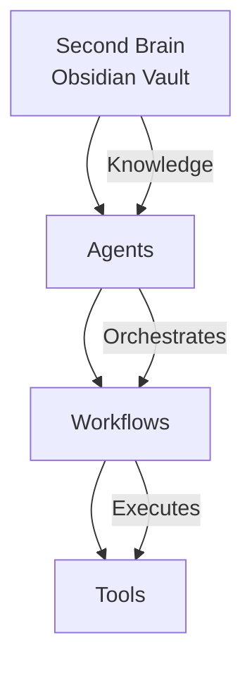
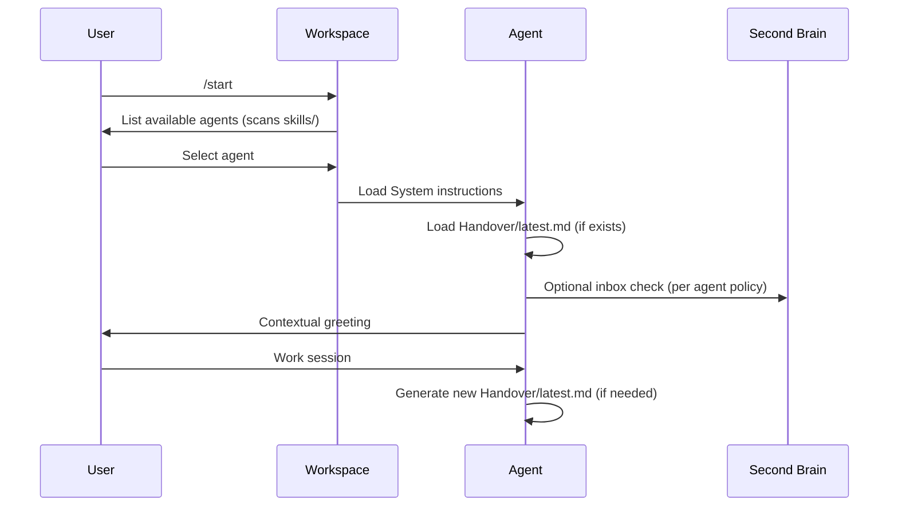

# Life OS Framework

## Overview

Life OS is a local-first, agent-powered Life Operating System built on top of:

* **Obsidian** (Second Brain)
* **Modular AI Agents**
* **Structured Workflows**
* **Deterministic Tools**

It separates **knowledge**, **intelligence**, and **execution** into clear layers.

---

# Core Principles

1. **Local-First**

   * Knowledge lives in Obsidian.
   * Synced via Syncthing (or your preferred sync tool).
   * No dependency on a cloud database.

2. **Modular Agents**

   * Each agent is self-contained.
   * Agents are portable.
   * Agents have defined roles and boundaries.

3. **Shared Workspace Logic**

   * Handovers live at agent level, not session level.
   * Registry defines active agents.
   * Session flow is standardized.

4. **Separation of Concerns**

   * Knowledge ≠ Agent
   * Agent ≠ Workflow
   * Workflow ≠ Tool

---

# System Layers



---

## Layer 1 — Second Brain (Knowledge Layer)

Location:

```
{{LIFEOS_ROOT}}/Second Brain/
```

Contains:

* Inbox
* Daily notes
* Projects
* Focus Areas
* Milestones
* Goals
* Values
* Dimensions

Purpose:

* Long-term memory
* Source of truth
* Graph-based relationships

Agents may read/write here depending on permissions.

---

## Layer 2 — Agents (Intelligence Layer)

Location:

```
{{LIFEOS_ROOT}}/AI/Agents/
```

Each Agent contains:

```
Agent/
├── System/
├── Workflows/
├── Tools/
└── Handover/
```

An Agent defines:

* Persona
* Responsibilities
* Boundaries
* Source access
* Session start/end behavior
* Handover policy

Agents store their own handovers.

---

## Layer 3 — Workspace (Coordination Layer)

Location: Your Craft Agent workspace folder.

Contains:

* Skills (session start, handoff, agent-specific)
* Labels and statuses
* Source configurations
* Session logic

Notes:

* Agent discovery scans workspace `skills/` folder
* `registry.json` defines agent metadata
* Session flow is standardized via `/start` and `/handoff` skills

This ensures:

* One handover skill
* Standardized session flow
* Scalability across devices

The handover skill is shared, but storage path is agent-owned.

---

## Layer 4 — Workflows (Process Layer)

Workflows are structured markdown files describing:

* Step-by-step procedures
* Required inputs
* Expected outputs
* Tool calls

Example:

* create-agent.md
* daily-review.md
* migration.md

Workflows are deterministic.
Persona lives in System, not here.

---

## Layer 5 — Tools (Execution Layer)

Optional scripts for:

* File manipulation
* Parsing
* Data analysis
* API calls

Tools are:

* Deterministic
* Stateless
* Reusable

Optional reusable templates for:

* Structured inputs.

Agents orchestrate.
Tools execute.

---

# Session Lifecycle

Canonical entry point: `/start`



---

# Handover Model

* Stored at Agent level
* Each agent owns its own continuity
* State-focused (not transcript-focused)
* Archived, not deleted
* Shared handover skill; agent-specific storage

Structure:

```
Agents/
  {agent-name}/
    Handover/
      latest.md
      Archive/
```

Rules:

1. On new handover:
   - Move existing `latest.md` → `Archive/{timestamp}-{session-id}.md`
   - Write new `latest.md`
2. Session start always reads `latest.md`
3. Handovers describe:
   - Current state
   - Active tasks
   - Decisions made
   - Next steps
   - Relevant files touched
4. Avoid full conversation excerpts unless explicitly required

---

# Memory Model

* **Short-term memory**: Current session context
* **Session continuity**: Handover
* **Long-term memory**: Obsidian (Second Brain)

No hidden memory.
No opaque state.

---

# Design Goals

* Scale to multiple agents
* Avoid duplicated logic
* Maintain structural consistency
* Remain device-independent

---

# Non-Goals (For Now)

* Autonomous orchestration
* Self-modifying agent system (no automatic structural changes)
* Fully automated inbox processing
* Complex cross-agent delegation

Clarification:

Agents may propose structural or workflow improvements.
Changes are applied only with explicit user approval.

---

# Agent Bootstrapping Pattern

1. Architect scaffolds:
   - Folder structure
   - System files
   - Minimal workflows
   - Handover policy

2. On first real usage:
   - Agent refines its workflows
   - Agent suggests improvements
   - User approves changes

Architect defines identity.
Agent evolves behavior — with user control.
