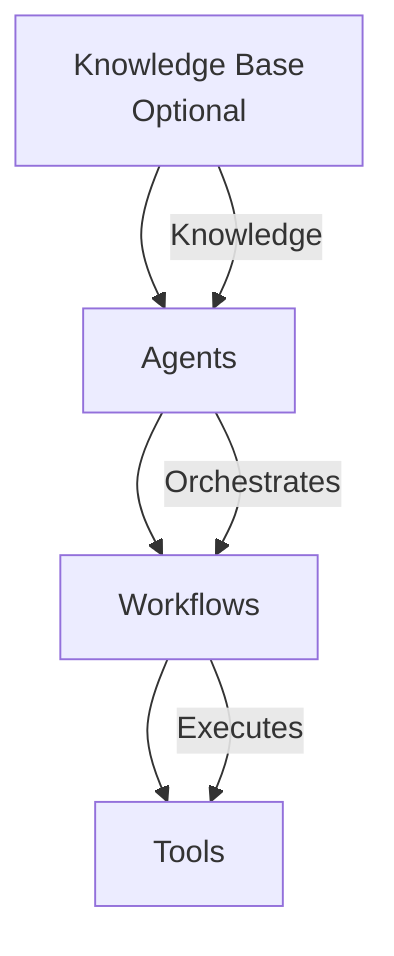
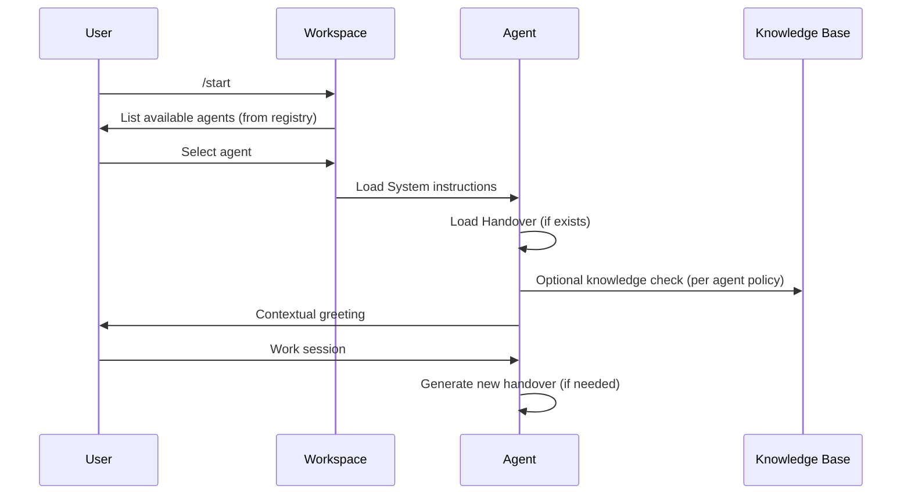

# Agent Blueprint Framework

## Overview

A local-first, agent-powered system built on top of:

* **Modular AI Agents** — specialized, independent, evolving
* **Structured Workflows** — deterministic, repeatable processes
* **Deterministic Tools** — scripts, templates, automation
* **Optional Knowledge Layer** — Obsidian vault or any local-first knowledge base

It separates **knowledge**, **intelligence**, and **execution** into clear layers.

---

# Core Principles

1. **Local-First**

   * All state lives in markdown files on disk.
   * Synced via your preferred tool (Syncthing, Obsidian Sync, iCloud, etc.).
   * No dependency on a cloud database.

2. **Modular Agents**

   * Each agent is self-contained.
   * Agents are portable.
   * Agents have defined roles and boundaries.

3. **Shared Workspace Logic**

   * Handovers live at agent level, not session level.
   * Registry defines active agents.
   * Session flow is standardized.

4. **Separation of Concerns**

   * Knowledge ≠ Agent
   * Agent ≠ Workflow
   * Workflow ≠ Tool

---

# System Layers



---

## Layer 1 — Knowledge (Optional)

Location:

```
{systemRoot}/Knowledge/
```

An optional knowledge layer for long-term memory. Can be:
* An Obsidian vault (recommended — graph view shows agent relationships)
* A plain folder of markdown files
* Any local-first knowledge system

Purpose:

* Long-term memory
* Source of truth
* Structured reference data

Agents may read/write here depending on permissions.

---

## Layer 2 — Agents (Intelligence Layer)

Location:

```
{systemRoot}/AI/Agents/
```

Each Agent contains:

```
Agent/
├── System/
├── Workflows/
├── Tools/
└── Handover/
```

An Agent defines:

* Persona
* Responsibilities
* Boundaries
* Source access
* Session start/end behavior
* Handover policy

Agents store their own handovers.

---

## Layer 3 — Workspace (Coordination Layer)

Location: Your Craft Agent workspace folder.

Contains:

* Skills (session start, handoff, agent-specific)
* Labels and statuses
* Source configurations
* Blueprint config (`agent-blueprint.json`)

Notes:

* Agent discovery scans `{systemRoot}/AI/Agents/registry/` (one JSON file per agent)
* Session flow is standardized via `/start` and `/handoff` skills
* `agent-blueprint.json` in the workspace root stores system root path and machine identity

This ensures:

* One handover skill
* Standardized session flow
* Scalability across devices

The handover skill is shared, but storage path is agent-owned.

---

## Layer 4 — Workflows (Process Layer)

Workflows are structured markdown files describing:

* Step-by-step procedures
* Required inputs
* Expected outputs
* Tool calls

Example:

* create-agent.md
* daily-review.md

Workflows are deterministic.
Persona lives in System, not here.

---

## Layer 5 — Tools (Execution Layer)

Optional scripts for:

* File manipulation
* Parsing
* Data analysis
* API calls

Tools are:

* Deterministic
* Stateless
* Reusable

Optional reusable templates for:

* Structured inputs.

Agents orchestrate.
Tools execute.

---

# Session Lifecycle

Canonical entry point: `/start`



---

# Handover Model

* Stored at Agent level
* Each agent owns its own continuity
* State-focused (not transcript-focused)
* Archived, not deleted
* Shared handover skill; agent-specific storage

## Single-Machine Agents

Agents with one context use a single handover file.

Structure:

```
Agents/{agent-name}/Handover/
├── latest.md
└── Archive/
```

Rules:
1. On new handover: move `latest.md` → `Archive/{date}-{session-id}.md`, write new `latest.md`
2. Session start reads `latest.md`

## Cross-Machine Agents (Optional)

Agents with multiple contexts (e.g. `"contexts": ["home", "office"]`) use per-machine handover files. This allows the agent to run on different machines without losing context from either.

Structure:

```
Agents/{agent-name}/Handover/
├── latest-desktop.md
├── latest-laptop.md
└── Archive/
    ├── {date}-desktop-{session-id}.md
    └── {date}-laptop-{session-id}.md
```

Machine identity is stored in `agent-blueprint.json` (`machine.slug` and `machine.context`). The `context` field is used to filter which agents are shown during `/start`.

Rules:
1. On new handover: archive only this machine's file, write new `latest-{slug}.md`
2. Session start reads ALL `latest-*.md` files for full cross-machine context
3. Each handover includes a `**Machine:**` header field

## Shared Rules

Handovers describe:
* Current state
* Active tasks
* Decisions made
* Next steps
* Relevant files touched

Avoid full conversation excerpts unless explicitly required.

---

# Memory Model

* **Short-term memory**: Current session context
* **Session continuity**: Handover
* **Accumulated learnings**: `System/learnings.md` (per agent)
* **Long-term memory**: Knowledge base (optional)

No hidden memory.
No opaque state.

---

# Design Goals

* Scale to multiple agents
* Avoid duplicated logic
* Maintain structural consistency
* Remain device-independent

---

# Non-Goals (For Now)

* Autonomous orchestration
* Self-modifying agent system (no automatic structural changes)
* Complex cross-agent delegation

Clarification:

Agents may propose structural or workflow improvements.
Changes are applied only with explicit user approval.

---

# Agent Bootstrapping Pattern

1. Architect scaffolds:
   - Folder structure
   - System files
   - Minimal workflows
   - Handover policy

2. On first real usage:
   - Agent refines its workflows
   - Agent suggests improvements
   - User approves changes

Architect defines identity.
Agent evolves behavior — with user control.
